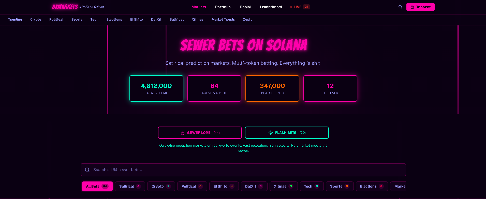
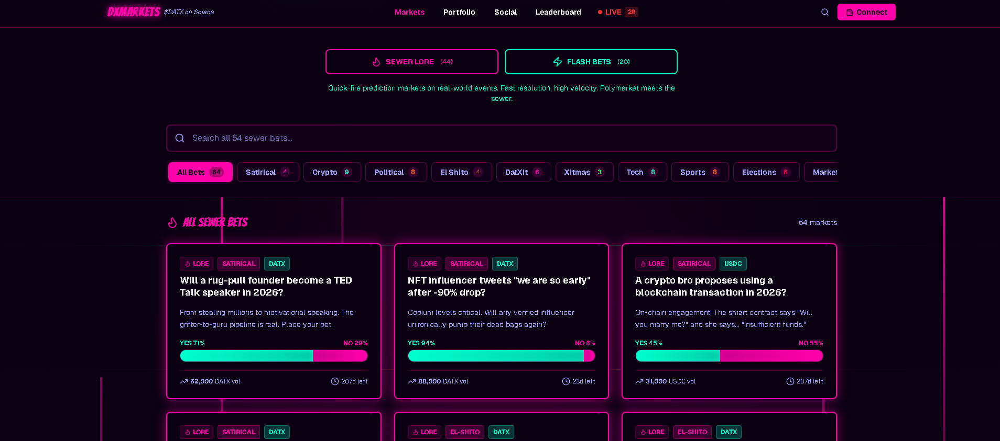
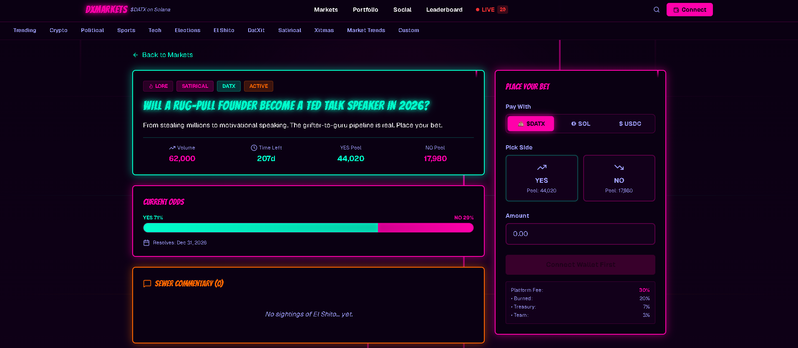
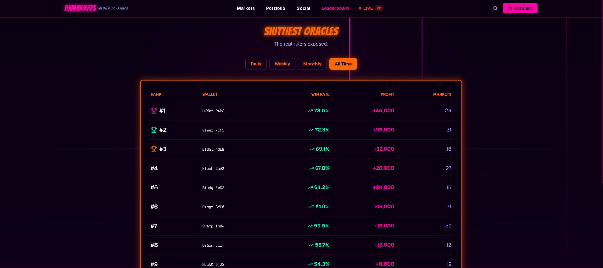

<div align="center">

# Solana Prediction Market

**An on-chain, community-resolved prediction market on Solana**

[](https://solana.com)
[](https://nextjs.org)
[](https://www.typescriptlang.org)
[]()

*Bet $DATX on contrarian, satirical propositions - community-resolved, deflationary, and bot-friendly.*

</div>

---

## What Is This?

DXMarket is the prediction-market arm of the $DATX ecosystem. Where mainstream markets price serious finance, DXMarket prices satire: contrarian propositions traded as simple binary (Yes/No) share markets. Users browse open markets, take a position with the native token, and climb a global leaderboard.

> **One token. Binary markets. Community resolution. A public API for bots.**

---

## Features

| Feature | Description | Status |
|---|---|:---:|
| Binary markets | Yes/No share markets with live pricing (`/bets`) | ✅ |
| Market detail | Proposition, chart, positions per market (`/markets/[id]`) | ✅ |
| Leaderboard | Global ranking of top predictors (`/leaderboard`) | ✅ |
| $DATX micro-bets | SPL-token positions, small rake, no fiat | 🚧 |
| Community resolution | Multisig + DAO vote | 🚧 |
| Deflationary burn | Burn a share of losing positions | 🚧 |
| Public bot API | Programmatic market read/trade | 🚧 |
| Cross-chain liquidity | Nitrolite state channels | Roadmap |

---

## How It Works

```
Next.js client ──▶ API routes (markets · resolution · public bot API)
       │                      │
       ▼                      ▼
  Phantom wallet      Solana programs (escrow · payout · burn)
                              │
                              ▼
                     $DATX SPL token + DAO governance
```

---

## Tech Stack

| Layer | Technology |
|-------|------------|
| Frontend | Next.js 16 (App Router, Turbopack), React, TypeScript |
| Styling | Tailwind CSS, shadcn/ui |
| Chain | Solana - SPL token, on-chain escrow & burn |
| Wallet | Phantom via Alchemy RPC |
| Data / API | Next.js API routes + Supabase (Postgres) |
| Cross-chain | Nitrolite (roadmap) |

---

## Project Structure

```
dxmarket/
anchor/
   programs/
   Anchor.toml
app/
   api/
   api-test/
   bets/
   debug/
   disclaimers/
   leaderboard/
components/
   compliance/
   layout/
   markets/
   sewer/
   ui/
   theme-provider.tsx
docs/
   ARCHITECTURE.md
   DATABASE_DIAGRAM.md
   KALSHI_OVERHAUL_PLAN_SOLANA.md
   lore-fast-markets-plan.md
   master-plan.md
   PROMPT_SEQUENCE.md
hooks/
   use-microcopy.ts
   use-mobile.ts
   use-toast.ts
   use-trades-websocket.ts
lib/
   api-client.ts
   bet-store.ts
   constants.ts
   format-utils.ts
   market-store.ts
   microcopy.ts
public/
   apple-icon.png
   icon-dark-32x32.png
   icon-light-32x32.png
   icon.svg
   placeholder-logo.png
   placeholder-logo.svg
scripts/
   001-create-schema.sql
   002-seed-data.sql
   004-add-market-type.sql
   005-kalshi-overhaul-phase1.sql
   006-rls-indexes-phase1.sql
   007-seed-content-pages.sql
styles/
   globals.css
.gitignore
components.json
next.config.mjs
next-env.d.ts
package.json
pnpm-lock.yaml
postcss.config.mjs
README.md
tsconfig.json
```

---

## Screenshots

<p align="center">
  
  
  
  
</p>

---

## Getting Started

```bash
pnpm install
cp .env.example .env.local   # add your own keys
pnpm dev
```

Environment variables (names only - never commit real values):

```
NEXT_PUBLIC_SUPABASE_URL=
NEXT_PUBLIC_SUPABASE_ANON_KEY=
SUPABASE_SERVICE_ROLE_KEY=
NEXT_PUBLIC_SOLANA_RPC_URL=
```

---

## Roadmap

- On-chain settlement and burn on Solana mainnet
- DAO-based market creation and resolution
- Public bot/API documentation
- Cross-chain liquidity via Nitrolite

---

## Notes

Shared as a portfolio artifact demonstrating product and system design. Early prototype; satirical and for entertainment only - not financial advice, no real-money gambling.

<div align="center">

Built on Solana · part of the $DATX ecosystem · MIT

</div>
