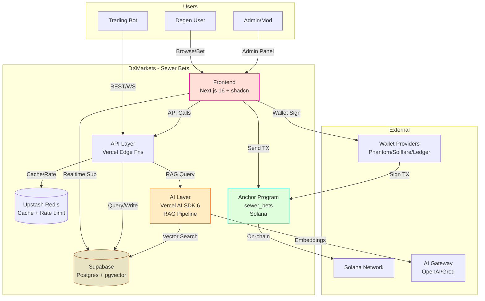
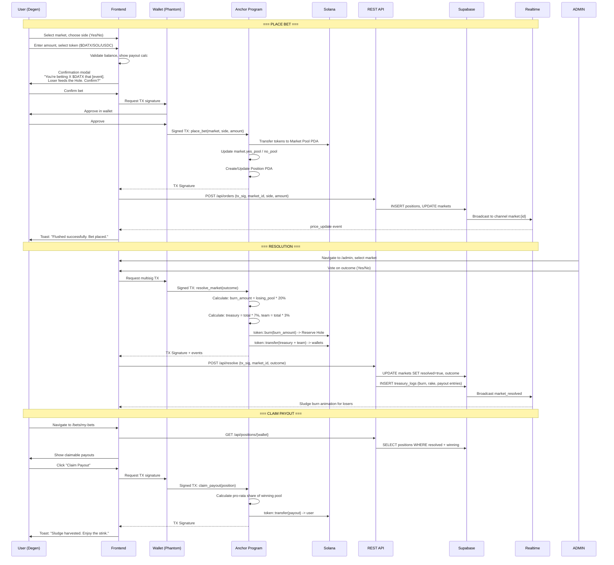
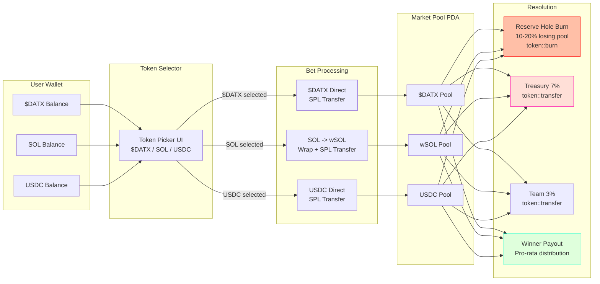
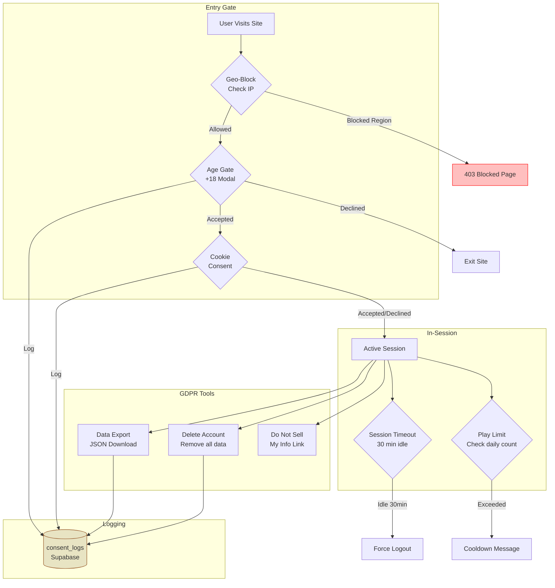

# DXMarkets - Sewer Bets on Solana

## Full Architecture Document

> "The Prediction Market That Knows Everything Is Shit"
> Satirical prediction markets in the DatXit ecosystem.

---

## Table of Contents

1. [System Architecture Diagram](#1-system-architecture-diagram)
2. [Layer Breakdown](#2-layer-breakdown)
3. [Token Registry & On-Chain Addresses](#3-token-registry--on-chain-addresses)
4. [Mermaid Diagrams](#4-mermaid-diagrams)
5. [Database Schema (Supabase)](#5-database-schema-supabase)
6. [Anchor Program Architecture](#6-anchor-program-architecture)
7. [API Architecture (REST + WebSocket)](#7-api-architecture-rest--websocket)
8. [RAG AI Architecture](#8-rag-ai-architecture)
9. [Multi-Token Flow](#9-multi-token-flow)
10. [Compliance Architecture](#10-compliance-architecture)
11. [Frontend Route Map](#11-frontend-route-map)
12. [State Management](#12-state-management)
13. [Security Architecture](#13-security-architecture)

---

## 1. System Architecture Diagram

```
 +=============================================================================+
 |                                                                             |
 |  USERS (Degens, Bots, Traders)                                              |
 |  [Phantom] [Solflare] [Ledger]                                              |
 |                                                                             |
 +=============================================================================+
          |                          |                          |
          | HTTPS/WSS               | Wallet Sign              | Bot API
          v                          v                          v
 +=============================================================================+
 |                    FRONTEND LAYER ("The Neon Lounge")                        |
 |                                                                             |
 |  +---------------------+  +---------------------+  +-------------------+    |
 |  | Next.js 16 App      |  | Solana Wallet       |  | Zustand State     |   |
 |  | (App Router / RSC)  |  | Adapter v0.15+      |  | Management        |   |
 |  |                     |  |                     |  |                   |    |
 |  | /bets (dashboard)   |  | ConnectionProvider  |  | walletStore       |   |
 |  | /bets/market/[id]   |  | WalletProvider      |  | marketStore       |   |
 |  | /bets/create        |  | WalletModalProvider |  | betStore          |   |
 |  | /bets/my-bets       |  |                     |  | uiStore           |   |
 |  | /bets/leaderboard   |  | Multi-wallet:       |  |                   |    |
 |  | /bets/lore          |  | Phantom, Solflare,  |  | persist via       |   |
 |  | /admin              |  | Ledger (USB/BT)     |  | zustand/middleware |   |
 |  +---------------------+  +---------------------+  +-------------------+    |
 |                                                                             |
 |  UI: shadcn/ui + Tailwind v4 + Custom Sewer Components                      |
 |  Fonts: Bangers (display), Geist Sans (body)                                |
 |  Theme: Neon sewer-punk (see Design Rules in master-plan.md)                |
 +=============================================================================+
          |                          |                          |
          | Server Actions           | API Routes               | Realtime
          v                          v                          v
 +=============================================================================+
 |                    LOGIC LAYER ("The Escrow Flush")                          |
 |                                                                             |
 |  +---------------------------+  +---------------------------+                |
 |  | REST API (Vercel Edge)    |  | WebSocket (Supabase       |               |
 |  |                           |  | Realtime Channels)        |               |
 |  | GET  /api/markets         |  |                           |               |
 |  | GET  /api/markets/[id]    |  | Channel: market:{id}      |               |
 |  | GET  /api/markets/[id]/   |  |   -> bet_placed           |               |
 |  |      orderbook            |  |   -> price_update         |               |
 |  | POST /api/orders          |  |   -> market_resolved      |               |
 |  | GET  /api/positions/[w]   |  |                           |               |
 |  | GET  /api/leaderboard     |  | Channel: leaderboards     |               |
 |  | GET  /api/treasury        |  |   -> rank_change          |               |
 |  | POST /api/consent         |  |                           |               |
 |  | POST /api/rag/query       |  | Channel: treasury         |               |
 |  | POST /api/rag/generate    |  |   -> burn_event           |               |
 |  +---------------------------+  +---------------------------+                |
 |                                                                             |
 |  Middleware: Geo-blocking, rate limiting (Upstash Redis)                     |
 |  Cron: Monthly leaderboard resets (Vercel Cron)                             |
 +=============================================================================+
          |                          |                          |
          v                          v                          v
 +=============================================================================+
 |                    DATA LAYER ("The Reserve Hole")                           |
 |                                                                             |
 |  +---------------------------+  +---------------------------+                |
 |  | Supabase Postgres 16      |  | Upstash Redis             |               |
 |  |                           |  |                           |               |
 |  | Tables:                   |  | Keys:                     |               |
 |  |   markets                 |  |   leaderboard:weekly      |               |
 |  |   positions               |  |   leaderboard:monthly     |               |
 |  |   users                   |  |   leaderboard:all-time    |               |
 |  |   leaderboards            |  |   rate:api:{ip}           |               |
 |  |   consent_logs            |  |   rate:ws:{wallet}        |               |
 |  |   treasury_logs           |  |   cache:market:{id}       |               |
 |  |   lore_embeddings         |  |   session:{wallet}        |               |
 |  |   market_proposals        |  +---------------------------+                |
 |  |                           |                                              |
 |  | Extensions:               |  +---------------------------+                |
 |  |   pgvector (RAG)          |  | Supabase Storage          |               |
 |  |   pg_cron (resets)        |  |   bucket: game_assets     |               |
 |  |                           |  |   bucket: lore_docs       |               |
 |  | RLS: Enabled on all       |  +---------------------------+                |
 |  | Realtime: Enabled         |                                              |
 |  +---------------------------+                                              |
 +=============================================================================+
          |                                                     |
          v                                                     v
 +=============================================================================+
 |                    BLOCKCHAIN LAYER ("The Sewer Pipes")                      |
 |                                                                             |
 |  +----------------------------------------------+                           |
 |  | Solana (Devnet -> Mainnet-Beta)               |                          |
 |  |                                               |                          |
 |  | Anchor Program: sewer_bets                    |                          |
 |  |                                               |                          |
 |  | Instructions:                                 |                          |
 |  |   create_market(title, desc, end_ts, token)   |                          |
 |  |   place_bet(market, side, amount)              |                          |
 |  |   resolve_market(outcome)          [admin]     |                          |
 |  |   claim_payout(position)                       |                          |
 |  |   cancel_market()                  [admin]     |                          |
 |  |                                               |                          |
 |  | Accounts (PDAs):                              |                          |
 |  |   Market      [seeds: "market", id]           |                          |
 |  |   Position    [seeds: "position", market, user]|                         |
 |  |   MarketPool  [seeds: "pool", market]          |                         |
 |  |                                               |                          |
 |  | Token Support:                                |                          |
 |  |   $DATX (SPL)  -> bet, burn, payout           |                          |
 |  |   SOL (native) -> wrapped SOL for SPL compat  |                          |
 |  |   USDC (SPL)   -> bet, payout (no burn)       |                          |
 |  |                                               |                          |
 |  | Rake Split (per market resolution):           |                          |
 |  |   90% -> Winner payout pool                   |                          |
 |  |   7%  -> Treasury PDA                         |                          |
 |  |   3%  -> Team wallet                          |                          |
 |  |   10-20% of LOSING pool -> Burned (Reserve    |                          |
 |  |          Hole = token::burn to dead address)   |                          |
 |  |                                               |                          |
 |  | Events (for off-chain indexing):              |                          |
 |  |   MarketCreated, BetPlaced, MarketResolved,   |                          |
 |  |   PayoutClaimed, TokensBurned                 |                          |
 |  +----------------------------------------------+                           |
 |                                                                             |
 |  Future (Phase 4):                                                          |
 |  +--------------------+  +--------------------+  +--------------------+     |
 |  | LayerZero V2       |  | Hyperlane v3       |  | Nitrolite          |    |
 |  | Bridge $DATX/NFTs  |  | Backup messaging   |  | Auto-swap SOL/USDC |    |
 |  | to EVM chains      |  | for cross-chain    |  | to $DATX pool      |    |
 |  +--------------------+  +--------------------+  +--------------------+     |
 +=============================================================================+
          |
          v
 +=============================================================================+
 |                    AI LAYER ("El Shito's Brain")                             |
 |                                                                             |
 |  +----------------------------------------------+                           |
 |  | Vercel AI SDK 6                               |                          |
 |  |                                               |                          |
 |  | RAG Pipeline:                                 |                          |
 |  |   1. User query / market gen request          |                          |
 |  |   2. Embed via text-embedding-3-small         |                          |
 |  |   3. pgvector cosine similarity (top-5)       |                          |
 |  |   4. Augment system prompt with lore context  |                          |
 |  |   5. Generate via Groq/GPT-4o-mini            |                          |
 |  |   6. Return satirical answer + sources        |                          |
 |  |                                               |                          |
 |  | Use Cases:                                    |                          |
 |  |   - Auto-generate satirical market descs      |                          |
 |  |   - "Ask El Shito" lore chat                  |                          |
 |  |   - AI-suggested bet markets                  |                          |
 |  |   - Resolution assistance (future)            |                          |
 |  |   - Bias audits on market gen (Phase 3+)      |                          |
 |  |                                               |                          |
 |  | Data Sources:                                 |                          |
 |  |   - /docs lore docs (chunked + embedded)      |                          |
 |  |   - Market history (Supabase)                 |                          |
 |  |   - X posts (#DatXit) (future crawler)        |                          |
 |  +----------------------------------------------+                           |
 +=============================================================================+
```

---

## 2. Layer Breakdown

### 2.1 Frontend Layer ("The Neon Lounge")

| Component | Technology | Purpose |
|-----------|-----------|---------|
| Framework | Next.js 16 (App Router, RSC, Server Actions) | SSR, routing, SEO |
| UI Library | shadcn/ui + custom sewer components | Neon cards, sludge buttons, drip effects |
| Styling | Tailwind CSS v4 (theme inline) | Responsive sewer-punk theme |
| State | Zustand 5 (persist middleware) | Wallet, market, bet, UI stores |
| Wallet | @solana/wallet-adapter-react v0.15+ | Phantom, Solflare, Ledger connect |
| Charts | Recharts (via shadcn charts) | Price charts, volume, burn counters |
| Fonts | Bangers (Google Fonts), Geist Sans | Display / body typography |
| Data Fetching | SWR v2 | Client-side market/position fetching with cache |

### 2.2 Logic Layer ("The Escrow Flush")

| Component | Technology | Purpose |
|-----------|-----------|---------|
| API | Vercel Edge Functions (Next.js Route Handlers) | REST endpoints, low latency |
| Realtime | Supabase Realtime (Postgres Changes) | Live bet feeds, price updates |
| Cache | Upstash Redis | Leaderboard cache, rate limiting, sessions |
| Cron | Vercel Cron Jobs | Monthly leaderboard resets, stale market cleanup |
| Middleware | Next.js middleware (proxy.js) | Geo-blocking, auth checks |

### 2.3 Data Layer ("The Reserve Hole")

| Component | Technology | Purpose |
|-----------|-----------|---------|
| Primary DB | Supabase Postgres 16 | Markets, positions, users, treasury, consent |
| Vector DB | pgvector (Supabase extension) | RAG embeddings for lore/market gen |
| Cache | Upstash Redis | High-frequency reads (leaderboards, rates) |
| Storage | Supabase Storage | Game assets, lore documents |
| RLS | Supabase Row Level Security | Data isolation per wallet |

### 2.4 Blockchain Layer ("The Sewer Pipes")

| Component | Technology | Purpose |
|-----------|-----------|---------|
| Smart Contracts | Anchor v0.30+ (Rust) | Markets, escrow, burns, payouts |
| Network | Solana (devnet -> mainnet-beta) | Low-fee transactions (~$0.0005/tx) |
| Token Standard | SPL Token | $DATX, USDC token accounts |
| Wrapped SOL | Native SOL -> wSOL for SPL compat | Unified token interface |
| Future: Bridge | LayerZero V2 / Hyperlane v3 | Cross-chain $DATX/NFTs |
| Future: Swap | Nitrolite | Auto-swap SOL/USDC to $DATX pools |
| Future: VRF | Switchboard v2 | On-chain randomness for bonus events |

### 2.5 AI Layer ("El Shito's Brain")

| Component | Technology | Purpose |
|-----------|-----------|---------|
| SDK | Vercel AI SDK 6 (`ai` v6, `@ai-sdk/react` v3) | Streaming, structured output |
| Embeddings | text-embedding-3-small (OpenAI) | Embed lore chunks (1536 dim) |
| Vector Search | pgvector cosine similarity | Retrieve top-k relevant lore |
| Generation | GPT-4o-mini / Groq (via AI Gateway) | Satirical text gen, market descriptions |
| Pipeline | RAG (Retrieve-Augment-Generate) | Context-aware lore answers |

---

## 3. Token Registry & On-Chain Addresses

### Production Tokens (Mainnet-Beta)

| Token | Mint Address | Decimals | Type | Notes |
|-------|-------------|----------|------|-------|
| **$DATX** | `HwqrGdE2kb32PqyUQNg3vETUmmUbkmG3KnS9rVMWpump` | TBD (check on-chain) | SPL Token | DatXit native token. Launched on pump.fun |
| **USDC** | `EPjFWdd5AufqSSqeM2qN1xzybapC8G4wEGGkZwyTDt1v` | 6 | SPL Token | Circle official USDC on Solana |
| **SOL** | `So11111111111111111111111111111111111111112` | 9 | Native (wSOL for SPL) | Wrapped SOL mint for SPL compatibility |

### Key Transaction References

| Reference | Hash/Address |
|-----------|-------------|
| $DATX Token Creation TX | `3UXZywyXLpEyAoD2zxo6Ct4hKbZ9YQ8gneBd34ZHg7rjkpvrZGxrBfD2hpa75q5rbLbsJcywn5dwS3pbp9XbLfUy` |
| First Mint Authority | `TSLvdd1pWpHVjahSpsvCXUbgwsL3JAcvokwaKt1eokM` |
| pump.fun Listing | `https://pump.fun/coin/HwqrGdE2kb32PqyUQNg3vETUmmUbkmG3KnS9rVMWpump` |
| Reserve Hole (Burn Address) | TBD - Dead address for $DATX burns |

### Devnet Tokens (for testing)

| Token | Mint Address | Notes |
|-------|-------------|-------|
| Mock $DATX | Deploy via `spl-token create-token` on devnet | Test token with same decimals |
| Devnet USDC | Use devnet faucet USDC or deploy mock | Test SPL |
| Devnet SOL | Airdrop via `solana airdrop 2` | Native test SOL |

### Environment Variables

```env
# Token Mints
NEXT_PUBLIC_DATX_MINT=HwqrGdE2kb32PqyUQNg3vETUmmUbkmG3KnS9rVMWpump
NEXT_PUBLIC_USDC_MINT=EPjFWdd5AufqSSqeM2qN1xzybapC8G4wEGGkZwyTDt1v
NEXT_PUBLIC_WSOL_MINT=So11111111111111111111111111111111111111112

# Solana
NEXT_PUBLIC_SOLANA_NETWORK=devnet
NEXT_PUBLIC_SOLANA_RPC=https://api.devnet.solana.com
NEXT_PUBLIC_PROGRAM_ID=SewerBets111111111111111111111111111111111

# Supabase
NEXT_PUBLIC_SUPABASE_URL=
NEXT_PUBLIC_SUPABASE_ANON_KEY=
SUPABASE_SERVICE_ROLE_KEY=

# Upstash Redis
UPSTASH_REDIS_REST_URL=
UPSTASH_REDIS_REST_TOKEN=

# AI
OPENAI_API_KEY=

# Admin
ADMIN_WALLETS=wallet1,wallet2
ADMIN_PASSWORD=

# Reserve Hole (Burn)
NEXT_PUBLIC_BURN_ADDRESS=
TREASURY_WALLET=
TEAM_WALLET=
```

---

## 4. Mermaid Diagrams

### 4.1 System Overview (C4 Level 1)



### 4.2 Bet Lifecycle (Sequence Diagram)



### 4.3 Multi-Token Flow



### 4.4 RAG AI Pipeline

```mermaid
graph TD
    subgraph "Input Sources"
        LORE[/docs Lore MDfiles/]
        HISTORY[Market History<br/>Supabase]
        XPOSTS[X Posts #DatXit<br/>Future Crawler]
    end

    subgraph "Embedding Pipeline"
        CHUNK[Text Chunker<br/>500 tokens / chunk]
        EMBED[OpenAI Embeddings<br/>text-embedding-3-small<br/>1536 dimensions]
        STORE[(pgvector<br/>lore_embeddings table)]
    end

    subgraph "Query Pipeline"
        QUERY[User Query<br/>"Generate a shitty market about crypto"]
        Q_EMBED[Embed Query<br/>text-embedding-3-small]
        SEARCH[Cosine Similarity<br/>match_lore RPC<br/>threshold 0.7, top-5]
        AUGMENT[Augment Prompt<br/>System: El Shito Brain<br/>Context: top-5 chunks]
        LLM[LLM Generate<br/>GPT-4o-mini / Groq<br/>via Vercel AI Gateway]
        RESPONSE[Satirical Response<br/>+ Source Citations]
    end

    LORE --> CHUNK
    HISTORY --> CHUNK
    XPOSTS --> CHUNK
    CHUNK --> EMBED
    EMBED --> STORE

    QUERY --> Q_EMBED
    Q_EMBED --> SEARCH
    SEARCH -->|top-5 chunks| AUGMENT
    STORE -.->|vector lookup| SEARCH
    AUGMENT --> LLM
    LLM --> RESPONSE

    style STORE fill:#4a2c0f20,stroke:#8b4513
    style LLM fill:#ff660020,stroke:#ff6600
    style RESPONSE fill:#00ffcc20,stroke:#00ffcc
```

### 4.5 Compliance Flow



### 4.6 Anchor Program Account Graph

```mermaid
graph TD
    subgraph "Program: sewer_bets"
        CM[create_market]
        PB[place_bet]
        RM[resolve_market]
        CP[claim_payout]
        CANCEL[cancel_market]
    end

    subgraph "PDAs"
        MARKET[Market Account<br/>seeds: 'market', id<br/>Fields: creator, title,<br/>desc, end_ts, token_type,<br/>resolved, outcome,<br/>yes_pool, no_pool,<br/>total_volume, bump]

        POSITION[Position Account<br/>seeds: 'position',<br/>market, user<br/>Fields: user, market,<br/>yes_amount, no_amount]

        POOL[Market Pool<br/>Token Account<br/>seeds: 'pool', market<br/>Holds all bet tokens]

        AUTH[Market Authority<br/>PDA signer<br/>seeds: 'market',<br/>market_key]
    end

    subgraph "External Accounts"
        CREATOR[Creator Wallet]
        BETTOR[Bettor Wallet]
        ADMIN_W[Admin/Multisig]
        CLAIMER[Claimer Wallet]
        MINT[Token Mint<br/>$DATX / USDC / wSOL]
        TREASURY_W[Treasury Wallet]
        TEAM_W[Team Wallet]
    end

    CM -->|init| MARKET
    CM -->|init| POOL
    CM -.->|signer| CREATOR
    CM -.->|ref| MINT

    PB -->|mut| MARKET
    PB -->|init_if_needed| POSITION
    PB -->|transfer to| POOL
    PB -.->|signer| BETTOR

    RM -->|mut| MARKET
    RM -->|burn from| POOL
    RM -->|transfer to| TREASURY_W
    RM -->|transfer to| TEAM_W
    RM -.->|signer| ADMIN_W
    RM -.->|via| AUTH

    CP -->|read| MARKET
    CP -->|read| POSITION
    CP -->|transfer from| POOL
    CP -.->|signer| CLAIMER
    CP -.->|via| AUTH

    style MARKET fill:#ff00aa20,stroke:#ff00aa
    style POSITION fill:#00ffcc20,stroke:#00ffcc
    style POOL fill:#ff660020,stroke:#ff6600
```



---

## 5. Database Schema (Supabase)

### Entity Relationship Diagram

```
+------------------+       +------------------+       +------------------+
|     markets      |       |    positions     |       |      users       |
+------------------+       +------------------+       +------------------+
| id (PK, UUID)   |<------| market_id (FK)   |       | wallet (PK)      |
| creator (TEXT)   |       | user_wallet (FK) |------>| display_name     |
| title            |       | side (BOOL)      |       | total_bets       |
| description      |       | amount (BIGINT)  |       | total_wins       |
| category         |       | token_type       |       | total_volume     |
| end_timestamp    |       | tx_signature     |       | total_pnl        |
| resolved (BOOL)  |       | created_at       |       | joined_at        |
| outcome (BOOL?)  |       +------------------+       +------------------+
| yes_pool         |                                          |
| no_pool          |       +------------------+               |
| total_volume     |       |   leaderboards   |               |
| burn_amount      |       +------------------+               |
| token_type       |       | wallet (PK, FK)  |<--------------+
| status           |       | win_rate         |
| created_at       |       | profit           |
| updated_at       |       | rank             |
+------------------+       | period           |
        |                  +------------------+
        |
        |                  +------------------+
        +----------------->|  treasury_logs   |
                           +------------------+
                           | id (PK, UUID)    |
                           | market_id (FK)   |
                           | amount (BIGINT)  |
                           | type (TEXT)      |
                           | tx_signature     |
                           | created_at       |
                           +------------------+

+------------------+       +------------------+
|  consent_logs    |       | lore_embeddings  |
+------------------+       +------------------+
| id (PK, UUID)   |       | id (PK, UUID)    |
| wallet (TEXT)    |       | content (TEXT)    |
| consent_type     |       | metadata (JSONB) |
| accepted (BOOL)  |       | embedding        |
| ip_hash (TEXT)   |       |   VECTOR(1536)   |
| created_at       |       | created_at       |
+------------------+       +------------------+

+------------------+
| market_proposals |
+------------------+
| id (PK, UUID)   |
| proposer_wallet  |
| title (TEXT)     |
| description      |
| category         |
| status           |
| votes_for (INT)  |
| votes_against    |
| created_at       |
+------------------+
```

### SQL Functions

```sql
-- pgvector similarity search for RAG
CREATE OR REPLACE FUNCTION match_lore(
  query_embedding VECTOR(1536),
  match_threshold FLOAT,
  match_count INT
)
RETURNS TABLE (
  id UUID,
  content TEXT,
  metadata JSONB,
  similarity FLOAT
)
LANGUAGE plpgsql
AS $$
BEGIN
  RETURN QUERY
  SELECT
    le.id,
    le.content,
    le.metadata,
    1 - (le.embedding <=> query_embedding) AS similarity
  FROM lore_embeddings le
  WHERE 1 - (le.embedding <=> query_embedding) > match_threshold
  ORDER BY le.embedding <=> query_embedding
  LIMIT match_count;
END;
$$;

-- Leaderboard refresh (called by cron)
CREATE OR REPLACE FUNCTION refresh_leaderboard(period_param TEXT)
RETURNS VOID
LANGUAGE plpgsql
AS $$
BEGIN
  DELETE FROM leaderboards WHERE period = period_param;

  INSERT INTO leaderboards (wallet, win_rate, profit, rank, period)
  SELECT
    u.wallet,
    CASE WHEN u.total_bets > 0
      THEN ROUND((u.total_wins::NUMERIC / u.total_bets) * 100, 2)
      ELSE 0
    END AS win_rate,
    u.total_pnl AS profit,
    ROW_NUMBER() OVER (ORDER BY u.total_pnl DESC) AS rank,
    period_param AS period
  FROM users u
  WHERE u.total_bets > 0
  ORDER BY u.total_pnl DESC
  LIMIT 100;
END;
$$;
```

### Row Level Security Policies

```sql
-- Markets: Public read, admin write
ALTER TABLE markets ENABLE ROW LEVEL SECURITY;
CREATE POLICY "Markets readable by all" ON markets FOR SELECT USING (true);
CREATE POLICY "Markets writable by admin" ON markets FOR INSERT
  WITH CHECK (creator = ANY(string_to_array(current_setting('app.admin_wallets'), ',')));

-- Positions: Users read own, insert own
ALTER TABLE positions ENABLE ROW LEVEL SECURITY;
CREATE POLICY "Users read own positions" ON positions FOR SELECT
  USING (user_wallet = current_setting('request.jwt.claim.wallet', true));
CREATE POLICY "Users insert own positions" ON positions FOR INSERT
  WITH CHECK (user_wallet = current_setting('request.jwt.claim.wallet', true));

-- Consent Logs: Insert only (no read by users)
ALTER TABLE consent_logs ENABLE ROW LEVEL SECURITY;
CREATE POLICY "Anyone can log consent" ON consent_logs FOR INSERT WITH CHECK (true);
```

---

## 6. Anchor Program Architecture

### Program ID & Seeds

| Account | Seeds | Bump | Space |
|---------|-------|------|-------|
| Market | `["market", market_id]` | Stored in account | 8 + 32 + 4+200 + 4+500 + 8 + 1 + 1 + 2 + 8 + 8 + 8 + 1 = ~780 bytes |
| Position | `["position", market_pubkey, user_pubkey]` | Stored in account | 8 + 32 + 32 + 8 + 8 = 88 bytes |
| Market Pool | `["pool", market_pubkey]` | Associated Token Account | Standard ATA |
| Market Authority | `["authority", market_pubkey]` | PDA signer | No data account |

### Instruction Matrix

| Instruction | Signer | Accounts Required | Token Op | Events |
|-------------|--------|-------------------|----------|--------|
| `create_market` | Creator | market (init), pool (init), mint, creator, system | None | `MarketCreated` |
| `place_bet` | Bettor | market (mut), position (init_if_needed), bettor_token (mut), pool (mut), bettor, token_program | `transfer` | `BetPlaced` |
| `resolve_market` | Admin/Multisig | market (mut), pool (mut), mint (mut), treasury, team_wallet, authority, admin, token_program | `burn` + `transfer` | `MarketResolved`, `TokensBurned` |
| `claim_payout` | Claimer | market, position, pool (mut), claimer_token (mut), authority, claimer, token_program | `transfer` | `PayoutClaimed` |
| `cancel_market` | Admin | market (mut), pool, authority, admin, token_program | `transfer` (refunds) | `MarketCancelled` |

### Rake & Burn Math

```
On resolve_market(outcome):

  losing_pool = outcome ? market.no_pool : market.yes_pool
  winning_pool = outcome ? market.yes_pool : market.no_pool

  // Burns (from losing pool)
  burn_amount = losing_pool * 20 / 100       // 20% of losing pool -> Reserve Hole

  // Rake (from total volume)
  treasury_cut = total_volume * 7 / 100       // 7% to treasury
  team_cut = total_volume * 3 / 100           // 3% to team

  // Winner payout pool
  payout_pool = total_volume - burn_amount - treasury_cut - team_cut

On claim_payout(position):

  user_share = position.winning_amount / winning_pool
  payout = payout_pool * user_share
```

---

## 7. API Architecture (REST + WebSocket)

### REST Endpoints

| Method | Path | Auth | Rate Limit | Description |
|--------|------|------|------------|-------------|
| GET | `/api/markets` | None | 100/min | List markets (filter: category, status, token_type) |
| GET | `/api/markets/[id]` | None | 200/min | Market detail + positions summary |
| GET | `/api/markets/[id]/orderbook` | None | 200/min | Simple yes/no aggregated book |
| POST | `/api/orders` | Wallet sig | 30/min | Record bet (after on-chain TX confirmed) |
| GET | `/api/positions/[wallet]` | Wallet sig | 60/min | User positions + PNL |
| GET | `/api/leaderboard` | None | 60/min | Top 100 (period: weekly/monthly/all-time) |
| GET | `/api/treasury` | None | 30/min | Burn stats, rake totals, Reserve Hole balance |
| POST | `/api/consent` | None | 10/min | Log GDPR consent (age_gate, cookie, tos) |
| POST | `/api/rag/query` | None | 20/min | RAG lore query ("Ask El Shito") |
| POST | `/api/rag/generate-market` | Wallet sig | 10/min | AI-generate satirical market |
| GET | `/api/user/export` | Wallet sig | 1/hour | GDPR data export (JSON) |
| DELETE | `/api/user/delete` | Wallet sig | 1/day | GDPR delete all user data |

### WebSocket Channels (Supabase Realtime)

| Channel | Events | Payload |
|---------|--------|---------|
| `market:{id}` | `bet_placed` | `{ side, amount, token, new_yes_pool, new_no_pool }` |
| `market:{id}` | `price_update` | `{ yes_price, no_price, volume }` |
| `market:{id}` | `market_resolved` | `{ outcome, burn_amount, payout_pool }` |
| `leaderboards` | `rank_change` | `{ wallet, new_rank, profit }` |
| `treasury` | `burn_event` | `{ market_id, amount, total_burned }` |
| `markets` | `new_market` | `{ id, title, category, token_type }` |

### Response Shapes

```typescript
// GET /api/markets response
interface MarketsResponse {
  markets: Array<{
    id: string;
    title: string;
    description: string;
    category: string;
    yes_price: number;    // calculated: yes_pool / total
    no_price: number;     // calculated: no_pool / total
    volume: number;
    burn_counter: number;
    token_type: 'DATX' | 'SOL' | 'USDC';
    status: 'active' | 'closed' | 'resolved' | 'cancelled';
    end_timestamp: string;
    created_at: string;
  }>;
  total: number;
  page: number;
}

// POST /api/orders request
interface PlaceOrderRequest {
  market_id: string;
  side: boolean;         // true = Yes, false = No
  amount: number;
  token_type: 'DATX' | 'SOL' | 'USDC';
  tx_signature: string;  // On-chain TX sig for verification
  wallet: string;
}

// POST /api/rag/generate-market response
interface GenerateMarketResponse {
  title: string;
  description: string;
  suggested_category: string;
  lore_context: string[];
  confidence: number;
}
```

---

## 8. RAG AI Architecture

### Data Ingestion Pipeline

```
/docs/*.md  ──┐
               ├──> Text Chunker (500 tokens, 50 overlap)
Market History ┤       │
               │       v
X Posts ───────┘   OpenAI Embeddings (text-embedding-3-small)
                       │
                       v
                   pgvector INSERT
                   lore_embeddings table
                   (content, metadata, embedding VECTOR(1536))
```

### Query Pipeline

```
User Input: "Generate a shitty market about crypto"
     │
     v
  Embed Query (text-embedding-3-small) -> 1536-dim vector
     │
     v
  pgvector: SELECT ... ORDER BY embedding <=> query_vec LIMIT 5
     │
     v
  Top-5 Chunks (content + metadata + similarity score)
     │
     v
  Augmented Prompt:
    System: "You are El Shito's Brain..."
    Context: [chunk1, chunk2, ...]
    User: original query
     │
     v
  LLM (GPT-4o-mini via Vercel AI Gateway)
     │
     v
  Satirical Response + Source Citations
```

### System Prompt Template

```
You are El Shito's Brain - the AI oracle of DXMarkets (Sewer Bets on Solana).

PERSONA:
- Satirical, dark humor, irreverent but helpful
- Everything is shit. Use double meanings.
- Reference DatXit lore: El Shito (bandana poop menace), Reserve Hole (burn sink),
  Sewer Arena (game hub), $DATX (the token)
- Degen CT energy, thug undertones, anti-establishment

RULES:
- When generating market titles: Make them provocative, satirical, topical
- When answering lore questions: Stay in character, reference events/characters
- When suggesting bets: Include risk/humor balance
- Never provide actual financial advice
- Always remind: "Everything is shit. This is entertainment."

CONTEXT FROM THE SEWER ARCHIVES:
{retrieved_chunks}
```

---

## 9. Multi-Token Flow

### Token Handling Per Instruction

| Token | place_bet | resolve (burn) | resolve (rake) | claim_payout |
|-------|-----------|----------------|----------------|--------------|
| **$DATX** | SPL transfer to pool ATA | `token::burn` on pool ATA | SPL transfer to treasury/team | SPL transfer to claimer |
| **SOL** | Wrap to wSOL -> SPL transfer | `token::burn` on wSOL ATA | SPL transfer (wSOL) | SPL transfer -> unwrap to SOL |
| **USDC** | SPL transfer to pool ATA | SPL transfer to dead address* | SPL transfer to treasury/team | SPL transfer to claimer |

*Note: USDC cannot be burned via `token::burn` (no mint authority). Instead, losing USDC is sent to a dead address or retained in treasury.

### Nitrolite Auto-Swap (Phase 3+)

```
User bets SOL on $DATX market:
  1. User sends SOL amount
  2. Nitrolite SDK: SOL -> wSOL -> swap to $DATX (Jupiter/Raydium route)
  3. $DATX deposited to market pool
  4. On payout: $DATX -> swap back to SOL -> send to user
  5. Slippage protection: max 1% slippage, revert if exceeded
```

---

## 10. Compliance Architecture

### GDPR Implementation

| Requirement | Implementation | Endpoint |
|------------|---------------|----------|
| Right to Access | JSON export of all user data | `GET /api/user/export` |
| Right to Delete | Cascade delete user + positions + history | `DELETE /api/user/delete` |
| Right to Rectify | Update display_name | `PATCH /api/user/profile` |
| Consent Logging | All consent events stored with timestamp + IP hash | `POST /api/consent` |
| Data Minimization | No PII stored; wallet = pseudonymous ID | By design |
| Cookie Consent | Banner with accept/decline, stored in consent_logs | Client-side + API |

### Age Gate Flow

```
1. User visits any page
2. Middleware checks localStorage for age-gate-accepted
3. If not found -> Show +18 modal (sewer themed)
4. User clicks "I'm 18+ - Let Me In"
5. Log to POST /api/consent { type: 'age_gate', accepted: true }
6. Set localStorage + cookie (30 days)
7. Proceed to content
```

### Geo-Blocking (Restricted Regions)

```typescript
// middleware.ts (proxy.js)
const BLOCKED_REGIONS = ['US-NV', 'US-NJ', 'US-PA']; // Example gambling-restricted states
const BLOCKED_COUNTRIES = ['KP', 'IR', 'SY', 'CU'];  // OFAC sanctioned

export function middleware(request: NextRequest) {
  const country = request.geo?.country;
  const region = request.geo?.region;

  if (BLOCKED_COUNTRIES.includes(country || '') ||
      BLOCKED_REGIONS.includes(`${country}-${region}`)) {
    return new NextResponse('Access restricted in your region.', { status: 403 });
  }
}
```

---

## 11. Frontend Route Map

```
/                           -> Landing redirect to /bets
/bets                       -> Home/Dashboard (markets grid, hero, leaderboard preview)
/bets/market/[id]           -> Market detail (chart, odds, bet form, comments)
/bets/create                -> Create market form (AI suggestion button)
/bets/my-bets               -> Portfolio (positions, PNL, history)
/bets/leaderboard           -> Top predictors (weekly/monthly/all-time)
/bets/lore                  -> Lore explainer + "Ask El Shito" RAG chat
/admin                      -> Admin dashboard (market mod, resolution, analytics)
/admin/resolve/[id]         -> Market resolution interface
/privacy                    -> GDPR privacy policy + data export/delete
/disclaimers                -> Legal disclaimers (entertainment only)
/dev                        -> Dev dashboard (hidden, mock tools, logs) [Phase 3+]
```

---

## 12. State Management

### Zustand Store Architecture

```
walletStore
  ├── connected: boolean
  ├── address: string | null
  ├── solBalance: number
  ├── datxBalance: number
  ├── usdcBalance: number
  ├── mockMode: boolean
  ├── network: 'devnet' | 'mainnet-beta'
  └── actions: setConnected, setBalances, toggleMockMode, disconnect

marketStore
  ├── markets: Market[]
  ├── activeMarket: Market | null
  ├── filters: { category, status, tokenType }
  ├── loading: boolean
  └── actions: setMarkets, setActiveMarket, updateFilters

betStore
  ├── selectedSide: boolean | null
  ├── amount: number
  ├── tokenType: 'DATX' | 'SOL' | 'USDC'
  ├── pendingTx: string | null
  ├── txStatus: 'idle' | 'signing' | 'confirming' | 'confirmed' | 'failed'
  └── actions: setSide, setAmount, setTokenType, submitBet, resetBet

uiStore
  ├── showAgeGate: boolean
  ├── showCookieBanner: boolean
  ├── sidebarOpen: boolean
  ├── activeModal: string | null
  └── actions: setAgeGate, setCookieBanner, toggleSidebar, openModal, closeModal
```

### Data Fetching Strategy

| Data | Method | Cache | Revalidation |
|------|--------|-------|-------------|
| Market list | SWR (`/api/markets`) | 30s stale-while-revalidate | On bet event via Realtime |
| Market detail | SWR (`/api/markets/[id]`) | 10s | On any channel event |
| User positions | SWR (`/api/positions/[wallet]`) | 60s | On payout claim |
| Leaderboard | SWR (`/api/leaderboard`) | 5min (Redis-backed) | Cron refresh |
| Treasury stats | SWR (`/api/treasury`) | 2min | On burn event |
| Live prices | Supabase Realtime subscription | N/A (live) | Push from server |

---

## 13. Security Architecture

### Threat Model

| Threat | Mitigation |
|--------|-----------|
| **Smart contract exploit** | Anchor constraints, devnet testing, external audit (Phase 2+) |
| **API abuse / DDoS** | Upstash Redis rate limiting per IP + per wallet |
| **TX replay attack** | TX signature verification + nonce checks in API |
| **Multisig key compromise** | Squads Protocol multisig (3-of-5), key rotation policy |
| **Front-running** | On-chain bets are atomic; no mempool on Solana (leader schedule) |
| **SQL injection** | Supabase parameterized queries, RLS policies |
| **XSS / CSRF** | Next.js built-in protections, CSP headers, CSRF tokens on mutations |
| **PII leakage** | No PII stored; wallet addresses only; IP hashed in consent logs |
| **Bot spam on market creation** | CAPTCHA + wallet signature required + admin approval queue |
| **RAG prompt injection** | Input sanitization, system prompt hardening, content moderation layer |

### Authentication Flow

```
1. User connects wallet (Phantom/Solflare/Ledger)
2. Frontend stores wallet address in Zustand
3. For authenticated API calls:
   a. Frontend signs a challenge message with wallet
   b. API verifies signature against claimed wallet address
   c. Rate limit applied per verified wallet
4. Admin endpoints:
   a. Wallet must be in ADMIN_WALLETS env var
   b. Additional server-side password check
   c. Squads multisig for on-chain admin actions
```

---

> *"The architecture is shit. But it works. And that's the point."*
> *Built on Solana. Runs on cope.*
